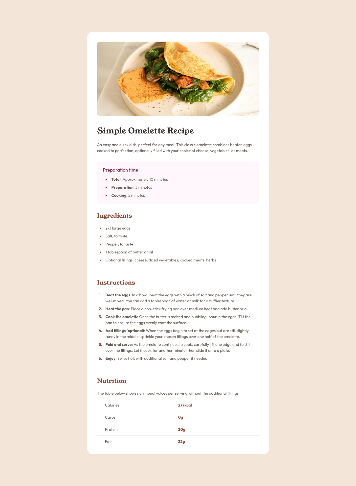

# Recipe Page Web Design

## Table of contents

- [Overview](#overview)
  - [Screenshot](#screenshot)
  - [Links](#links)
- [My process](#my-process)
  - [Built with](#built-with)
  - [What I learned](#what-i-learned)
- [Author](#author)

## Overview

### Screenshot



### Links

- Live Site URL: [Live Site](https://nashrulmalik.github.io/fm04-recipe-page/)

## My process

### Built with

- Semantic HTML5 markup
- CSS custom properties
- Flexbox

### What I learned

hr component can't be 0px
```css
hr {
    height: 0;
    border: 0.5px solid var(--stone-150)
}
```

Don't forget to remove the last-child margin bottom
```css
li:last-child {
    margin-bottom: 0; 
}
```

We can use span to make a distance between li marker and its content
```css
li span {
    position: relative;
    left: 10px;
}
```


## Author

- [Website](https://nashrulmalik.com)
- [Linkedin](https://www.linkedin.com/in/muhammad-nashrul-malik-aaa186b6/)
- [Twitter](https://www.twitter.com/nashrulmalik)